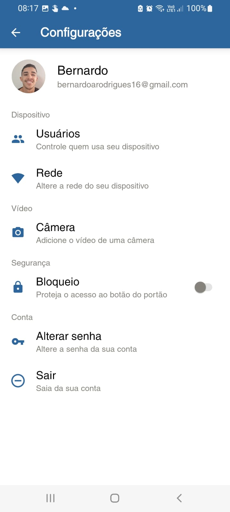

# Digital Lock - Android App
Mobile applciation that communicates with the Digital Lock device through Google Firebase's Realtime Database. Furthermore, it provides capabilities such as: multiple users controlling the lock, user management, device WIFI configuration, and more.

    
    

## Download
You can download the latest version of the app through this [website](https://chave-digital-br.web.app/).